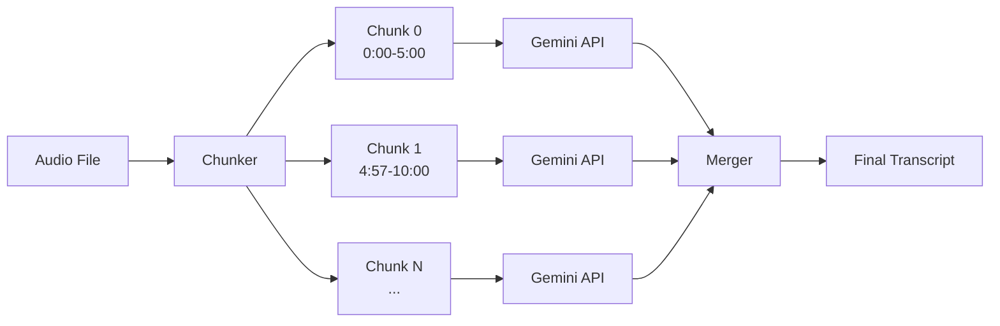

# Chunk Boundary Transcription Loss — Root Cause Analysis & Fix Plan

## Problem

Whole sentences or significant portions of audio are missing from the final transcript. The missing content appears to be at **chunk boundaries** — the start/end of consecutive chunks.

## Architecture Overview



**Current settings** (from `.env`):
- `max_chunk_duration = 300s` (5 minutes)
- `overlap_enabled = true`, `overlap_duration = 3.0s`
- `context_segments = 3` (last 3 segments passed as text context)
- `overlap_similarity_threshold = 0.8`

---

## Root Causes Identified

### 🔴 Root Cause 1: Prompt Instructs Gemini to SKIP Audio Content

**File:** [gemini.py](file:///Users/darakelyan/workspase/AI_Transformation_Squad/STT-tool/src/stt_service/providers/gemini.py#L276-L283)

```python
"**CRITICAL: DO NOT REPEAT the context provided above. 
 Start transcribing ONLY the new audio.**"
```

**The problem:** The audio chunk physically **contains** 3 seconds of overlapping audio from the previous chunk (that's what `overlap_duration=3.0` does). But the prompt tells Gemini to "NOT REPEAT" any content from the context and to transcribe "ONLY the new audio."

Gemini has no way to know exactly which audio corresponds to the "context" text. It sees:
1. Context text saying "Ես գնছադադdelays as far..."
2. Audio that starts with those same words (the overlap region)

**Result:** Gemini aggressively skips the first ~3-10 seconds of the audio chunk (not just the overlap portion) because it's trying to avoid repeating the context. In some cases, it over-compensates and skips an entire sentence or more.

> [!CAUTION]
> This is the **primary cause**. The overlap audio + "don't repeat" instruction creates a contradiction: the audio literally contains content the model is told to skip.

### 🟡 Root Cause 2: Overlap is Too Short for Reliable Stitching

**File:** [config.py](file:///Users/darakelyan/workspase/AI_Transformation_Squad/STT-tool/src/stt_service/config.py#L130)

A 3-second overlap is very short. If the chunk boundary falls mid-sentence (even with silence detection), 3 seconds may not be enough to capture the complete sentence in either chunk:

- **Chunk N** may cut off the last ~1 second of a sentence
- **Chunk N+1** starts only 3s earlier — if Gemini skips those 3s (per Root Cause 1), the sentence is lost entirely

### 🟡 Root Cause 3: Merger Deduplication May Remove Unique Content

**File:** [merger.py](file:///Users/darakelyan/workspase/AI_Transformation_Squad/STT-tool/src/stt_service/core/merger.py#L193-L243)

The deduplication logic in `_deduplicate_overlaps` removes segments with similar text. With Armenian text and a trigram-based similarity check at 0.8 threshold, there's a risk of:

- **False positives**: Two different but phonetically similar Armenian sentences could match above 0.8 similarity (especially short sentences)
- **Truncation**: When overlapping segments have different text, the previous segment's `end_time` is truncated to the next segment's `start_time` — potentially losing text

---

## Proposed Fix

### Fix 1: Remove the "Don't Repeat" Instruction (✅ Implemented)

Instead of telling Gemini to skip content, let it transcribe everything in the audio and let the **merger handle deduplication**.

```python
# src/stt_service/providers/gemini.py

# OLD
"**CRITICAL: DO NOT REPEAT the context provided above. Start transcribing ONLY the new audio.**"

# NEW
"**IMPORTANT: The audio may start with content already captured in the context above — "
"this is intentional overlap for continuity. Transcribe ALL audio content "
"from the very beginning of this clip (timestamp 0.0). The system will "
"automatically handle any overlap during merging.**"
```

**Rationale:** The merger already has deduplication logic (`_deduplicate_overlaps`). It's safer to get duplicate content from Gemini (which the merger removes) than to have Gemini skip content (which is unrecoverable).

### Fix 2: Increase Overlap Duration (✅ Implemented)

```python
# src/stt_service/config.py

# OLD
CHUNKING_OVERLAP_DURATION=3.0

# NEW
CHUNKING_OVERLAP_DURATION=5.0
```

More overlap = more safety margin for content at boundaries.

### Fix 3: Add Logging for Dropped Content (✅ Implemented)

Added `logger.warning("Truncating overlapping segment", ...)` in `merger.py` to track when content is being deduplicated, allowing us to monitor if it's too aggressive.

---

## Verification Plan

### Automated Tests
- Process a multi-chunk audio file and compare chunk-level output with the merged result
- Verify no segments are lost between chunks by checking sequential coverage

### Manual Verification
- Re-process the audio that exhibited missing sentences
- Compare output with and without the fix
- Check worker logs for deduplication warnings
